# TPA-004

* ERD (Entity Relationship Diagram)

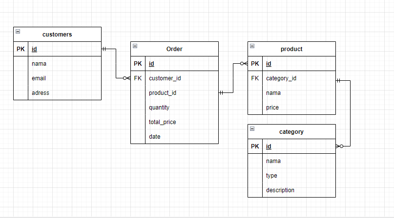

## DDL
* Create Database

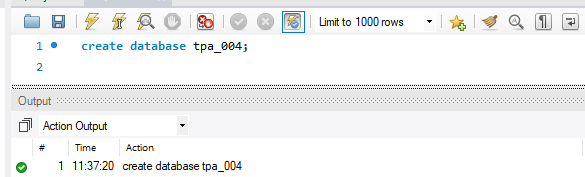

* create Table

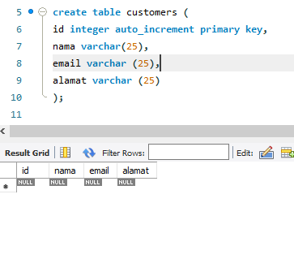

* insert table 

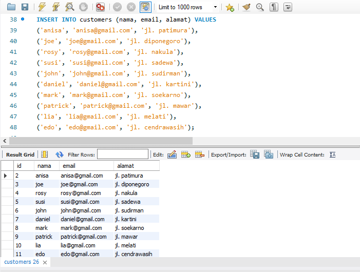

* inner join (Mengambil kolom nama tabel produksi dan kolom nama tabel category)

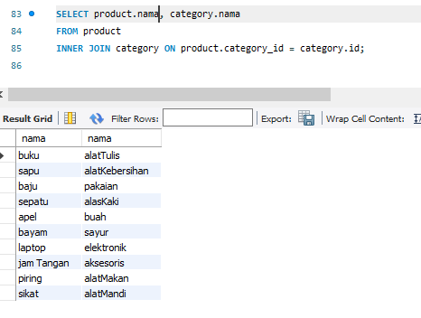

* delete (Menghapus data dari tabel customers, semula table seperti gambar pada insert kemudian dihapus maka menghasilkan)

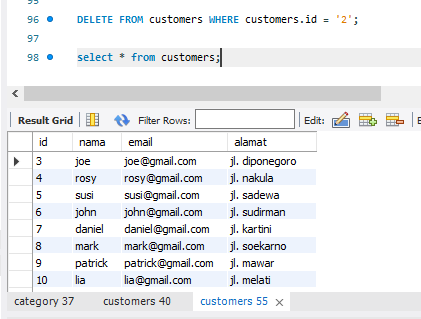

* update (mengganti nama dan email dari id 3, yang semula nama = joe dan email = joe@gmail.com menjadi nama = dono dan email = dono@gmail.com)

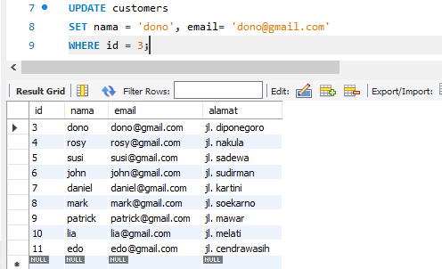

* product sering dibeli

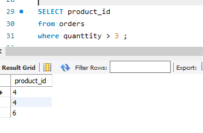

* category paling banyak productnya

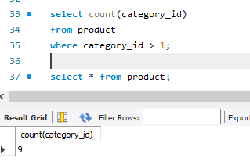

* menghapus table(sebelumnnya terdapat 4 table yaitu customers, orders, product dan category. kemudian category dihapus sehingga menampilkan 3 tabel seperti dibawah)

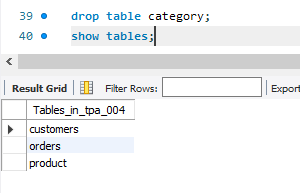

* menghapus database (menampilkan semua database setelah database tpa_004 dihapus)

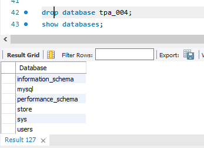
